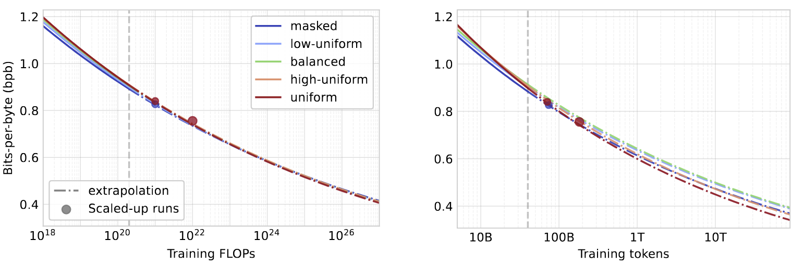

# Scaling Behavior of Discrete Diffusion Language Models

Dimitri von Rütte, Janis Fluri, Antonio Orvieto, Omead Pooladzandi, Bernhard Schölkopf, Thomas Hofmann


[](https://arxiv.org/abs/2512.10858)
[](https://huggingface.co/collections/dvruette/scaling-behavior-of-discrete-diffusion-language-models)

---

This repository contains the code to reproduce the experiments from the paper "Scaling Behavior of Discrete Diffusion Language Models".
It includes implementations of the model architecture, training procedures, and evaluation code used in the study.
The implementation is based on [EasyDeL](https://github.com/erfanzar/EasyDeL), a JAX-based framework for training and running LLMs at scale.

In our paper, we investigate the scaling behavior of discrete diffusion language models (DLMs) for different noise types (masking, uniform, and hybrid-noise), finding that all of them scale well in compute-bound settings and especially in token-bound settings, with uniform noise coming out on top for the latter.
To confirm these findings, we train scaled-up models to compute optimality.
Specifically, we train two 3B models (masked and uniform diffusion) as well as a 10B parameter uniform diffusion model, which, to the best of our knowledge, is the largest public uniform diffusion model to date.
Below we plot the compute-bound and token-bound scaling laws for all investigated noise types with the scaled-up runs (3B and 10B) overlayed as circles.

[](https://arxiv.org/abs/2512.10858)

| Model | Size | Train. PPL | Diffusion type | HuggingFace link |
|:------|-----:|-----------:|:---------------|:-----------------|
| `gidd-unif-10b` | 10B | 9.15 | uniform | https://huggingface.co/dvruette/gidd-unif-10b |
| `gidd-mask-3b` | 3B | 11.3 | masked | https://huggingface.co/dvruette/gidd-mask-3b |
| `gidd-unif-3b` | 3B | 11.7 | uniform | https://huggingface.co/dvruette/gidd-unif-3b |

## Quick Start

The 3B and 10B models are available as converted PyTorch models on HuggingFace and can be used as follows:

```python
import torch
from transformers import AutoModelForCausalLM, AutoTokenizer

device = "cuda" if torch.cuda.is_available() else "cpu"
model_name = "dvruette/gidd-10b-unif"

tokenizer = AutoTokenizer.from_pretrained(model_name)
model = AutoModelForCausalLM.from_pretrained(model_name, trust_remote_code=True, torch_dtype=torch.bfloat16)
model.eval().to(device)

prompt = "In a shocking finding, scientist discovered a herd of unicorns living in a remote, previously unexplored valley, in the Andes Mountains. Even more surprising to the researchers was the fact that the unicorns spoke perfect English."
inputs = tokenizer(prompt, return_tensors="pt", add_special_tokens=True).input_ids[:, :-1].to(device)

generated_ids = model.generate(
    inputs=inputs,
    max_length=128,
    block_length=128,
    steps=256,
    sampling_method="adaptive",
    temperature=0.0,
    show_progress=True,
)

print(tokenizer.batch_decode(generated_ids, skip_special_tokens=False)[0])
```


## Setup

The training code is written primarily to be run on TPUs but can also be run on GPUs.
To get started, clone the repository and install the required packages.
It is recommended to use [`uv`](https://github.com/astral-sh/uv) with a virtual environment, as this is how the code was developed and tested.

```bash
git clone https://github.com/dvruette/gidd-easydel
cd gidd-easydel
uv venv .venv --python 3.11
source .venv/bin/activate
uv pip install -r requirements.txt
uv pip install -e .
```

Make sure that the correct version of JAX is installed.
The JAX version used during development is `0.7.1`.
Depending on your hardware, use one of the following commands to install JAX with the appropriate backend:
```bash
# For TPU
uv pip install -U jax[tpu]==0.7.1
# For GPU
uv pip install -U jax[cuda12]==0.7.1

# Verify installation
uv pip show jax
# Should output `Version: 0.7.1`
```

The codebase also depends on a number of custom forks.
Depending on which tasks you would like to run (training or evaluation), please make sure to install the modified versions of the following packages:
- dvruette/EasyDeL (for training): https://github.com/dvruette/EasyDeL
- dvruette/eformer (for training): https://github.com/dvruette/eformer
- dvruette/orbax (for checkpointing on TPU + HNS storage): https://github.com/dvruette/orbax/tree/fix-glob-step-path-on-hns
- dvruette/lm-evaluation-harness (for evaluation): https://github.com/dvruette/lm-evaluation-harness/tree/gidd-v2

## Training

#### GPU
For running the training code on GPU, you can use the `main_gpu.py` script.
An example command to launch a training run on GPU is as follows:

```bash
# recommended for local runs only: skip safety check for whether data/checkpoint buckets are in the same region as the TPU
export SKIP_GS_LOCATION_CHECK=1
# configure data and checkpoint paths
export DATA_FILES=/local/path/to/data/files/
export SAVE_DIRECTORY=/local/path/to/checkpoints/
# start a training run
python main_gpu.py --batch_size 16 --lr 0.2 --num_layers 8 --hidden_size 512 --num_attn_heads 8 --max_seq_len 512 --hybrid_mixing_shift 1000.0
```

#### TPU
For running the training code on TPU, it is recommended to use [`ray`](https://ray.io/) as a coordinator.
We will not go into details on how to set up a TPU cluster with `ray` here (see [here](https://docs.ray.io/en/latest/cluster/getting-started.html) for details), but the entrypoint for this case is the `main_ray.py` script.
The scripts is configured through environment variables as described in the comments at the top of the file.
An example command to launch a training run on a TPU cluster with `ray` is as follows (you can also set some of these environment variables in your ray cluster config):

```bash
ray job submit -- \
    TPU_VERSION=v5p-8 \
    TPU_POD_COUNT=1 \
    TPU_ZONE=us-east5-a \
    SAVE_DIRECTORY=gs://your-checkpointing-bucket/your-path/ \
    DATA_FILES=gs://your-data-bucket/your-path/ \
    WANDB_API_KEY_FOR_EASYDEL=your-wandb-key \
    HF_TOKEN_FOR_EASYDEL=your-huggingface-token \  # only needed for gated/private models/tokenizers
    python main_ray.py --batch_size 16 --lr 0.2 --num_layers 8 --hidden_size 512 --num_attn_heads 8 --max_seq_len 512 --hybrid_mixing_shift 1000.0
```

## Evaluation

To evaluate a trained model, you can use the custom fork of the `lm-evaluation-harness` package.
The forked version includes a custom model for loading the Orbax checkpoints produced by the training script and performs inference directly in JAX.

#### GPU
On a (local) GPU machine, you can run the evaluation as follows:

```bash
lm_eval --model gidd --model_args checkpoint_dir="/local/path/to/orbax/checkpoint/",num_layers=8,hidden_size=512,num_attn_heads=8,hybrid_mixing_shift=1000.0,prior_distribution=uniform,num_denoising_steps=128 --tasks gsm8k --batch_size 8
```

Note that by default, this will run the model in FSDP across all visible devices. If you wish to limit the number of devices used, you can set the `CUDA_VISIBLE_DEVICES` environment variable accordingly.

#### TPU
On a TPU Ray cluster, you can use the `eval_ray.py` script to run the evaluation.
An example command looks as follows:

```bash
ray job submit -- \
    TPU_VERSION=v6e-8 \
    TPU_POD_COUNT=1 \
    python eval_ray.py \
        --model gidd \
        --model_args 'checkpoint_dir=gs://your-checkpointing-bucket/path/to/checkpoint/gidd/orbax/,num_layers=8,hidden_size=512,num_attn_heads=8,hybrid_mixing_shift=1000.0,prior_distribution=uniform,num_denoising_steps=128' \
        --tasks gsm8k \
        --batch_size 32
```

## Citation
If you find this work useful in your research, please consider citing our paper:

```
@article{von2025scaling,
  title={Scaling Behavior of Discrete Diffusion Language Models},
  author={von R{\"u}tte, Dimitri and Fluri, Janis and Pooladzandi, Omead and Sch{\"o}lkopf, Bernhard and Hofmann, Thomas and Orvieto, Antonio},
  journal={arXiv preprint arXiv:2512.10858},
  year={2025}
}
```

## License
This repository is released under the Apache License 2.0. See the [LICENSE](LICENSE) file for details.
